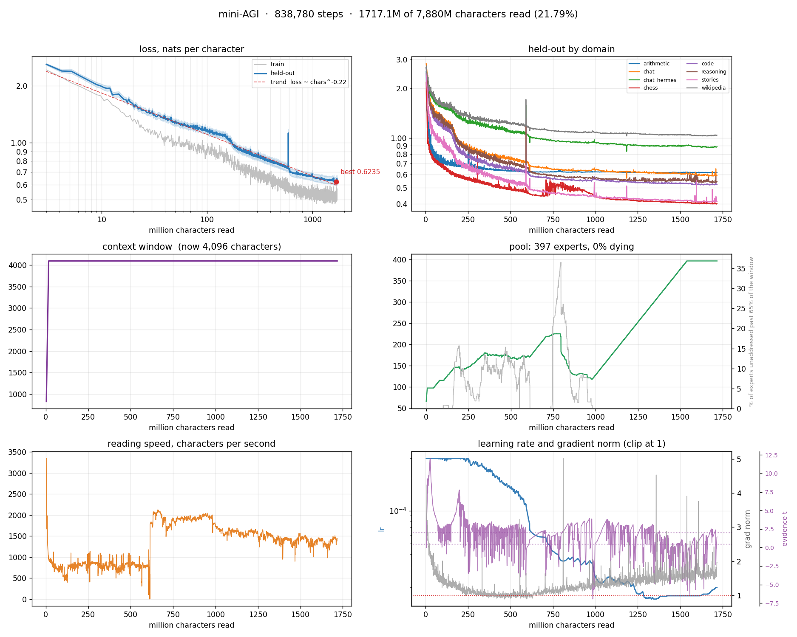
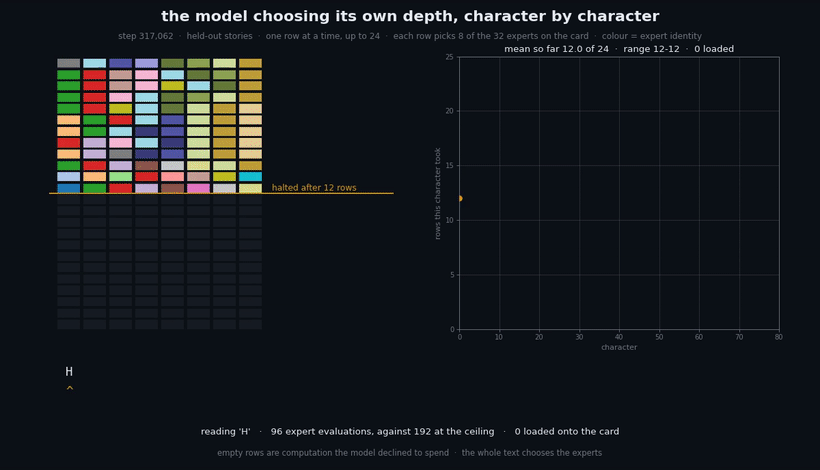
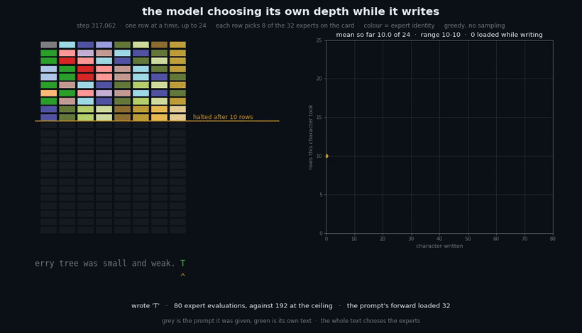
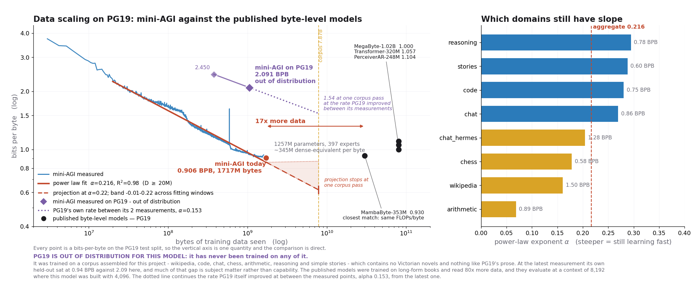

# Greenlight Recur

**Greenlight Recur** is an experimental local AI research project derived from [volotat/mini-AGI](https://github.com/volotat/mini-AGI), focused on making mini-AGI easier to test, reproduce, harden, and run on consumer hardware.

The original mini-AGI architecture and research project are by its upstream author. Greenlight Recur builds on that work rather than claiming to replace it.

## Greenlight command line

Install the dependencies into your active Python environment:

```bash
python -m pip install -r requirements.txt
python greenlight.py doctor
python greenlight.py --help
```

Use a CUDA-enabled PyTorch build for NVIDIA training. The doctor command reports
whether this environment can actually use CUDA. No cloud service is needed.

Train for **up to six minutes or one corpus pass**, saving the result:

```bash
python greenlight.py train --train data/train --held-out data/val \
  --weights greenlight-16g-r1 --minutes 6 --out runs/r1-first
```

Compare your saved old checkpoint with a separately trained copy:

```bash
python greenlight.py compare --old greenlight-16g-r1 --new greenlight-16g-r2 \
  --train data/train --held-out data/val --minutes 6 --out runs/r1-vs-r2
```

The old checkpoint is read-only. `--new` and `--out` must be new paths. Allow disk
space for a complete checkpoint copy, including optimizer state. Stop other
training processes that write the old checkpoint before comparison. This compares
**before/after continued training using the current code**, not two code revisions
or architectures. Resuming uses the saved model shape; it does not resize old weights
to the selected profile. `--passes` controls the corpus-pass limit; `--minutes`
limits the training loop, not model loading or evaluation time.

Reports `old.json` and `new.json` include prompt outputs, held-out loss, corpus
fingerprint, settings, and comparison deltas. Negative held-out loss delta is lower
loss; a tiny change on a small sample is not evidence of general capability. Keep
training and held-out text separate. Existing checkpoints resume in `train`;
choose a new weights path for fresh training. Choose a new output path per run.

Use your own trained Greenlight model from the terminal:

```bash
python greenlight.py generate --weights greenlight-16g-r2 --prompt "The dragon"
```

Or use the separate Ollama tool assistant with an already installed local model:

```bash
python greenlight.py chat --model qwen3:8b --workspace .
```

Ollama must be running locally. This assistant uses the selected Ollama model;
it does not load your Greenlight checkpoint. For small CPU smoke tests, use a tiny
config with `--device cpu --precision fp32`; the 16 GB profile is intended for GPU
training. See [the CLI repair log](docs/CLI-TRAINING-2026-09-27.md).

## What Greenlight Recur adds

Greenlight Recur currently focuses on:

- a practical 16 GB VRAM training configuration
- reproducible local training and evaluation
- automated CI and regression testing
- a benchmark/provenance harness
- model and expert stress tests
- safer paged-model loading and dry-read behaviour
- evaluation context/RoPE boundary protection
- serving and KV-cache rollover hardening
- GradSNR robustness when active gradient sets change
- safer corpus/cache handling
- expert-pool diagnostics and plotting
- a Training Doctor that checks restart, routing, retention and generation
  rather than the loss curve alone — see `docs/TRAINING-DOCTOR-V2.md`
- a local agent interface and local Ollama integration
- compatibility work for ongoing upstream mini-AGI development

## Hardware target

The primary Greenlight Recur development target is a single consumer NVIDIA GPU with **16 GB VRAM** and **32 GB system RAM**.

The goal is not to claim that this is the minimum hardware mini-AGI can use. It is the configuration we actively develop and test against.

## Relationship with upstream

Greenlight Recur tracks the original mini-AGI project and aims to remain compatible with useful upstream developments.

Where possible, bugs are reproduced before being patched and regression tests are added alongside fixes. Upstream changes are reviewed before integration so that Greenlight-specific reliability fixes are not silently overwritten.

Greenlight Recur is also intended to be a good place to validate fixes that may be useful upstream.

## Project status

**Experimental / active development.**

Greenlight Recur is research software. Passing tests and successful training runs do not imply that the model has achieved AGI.

Benchmark results should only be compared when the model, dataset, checkpoint, configuration, evaluation procedure, and hardware conditions are sufficiently matched.

## Credits

Greenlight Recur exists because of the original **mini-AGI** project and its architecture, training work, experiments, and continued upstream development.

- Original project: https://github.com/volotat/mini-AGI
- Greenlight Recur development repository: https://github.com/SpidermanTotro/mini-AGI

---

## Greenlight lab rounds

`greenlight_lab.py` runs bounded training/evaluation rounds in a separate
`greenlight-16g-lab` checkpoint. It accepts reviewed feedback and does not
recycle generated completions into training automatically.

```bash
python greenlight_lab.py path/to/train.txt path/to/held-out.txt \
    --config config-16gb.yaml --rounds 3 --minutes-per-round 1
```

Logs, samples, and expert history go under `runs/greenlight-lab`. The R1
baseline directory is protected by the runner. `GREENLIGHT_CONFIG` selects a
profile; `MINI_AGI_CONFIG` remains a compatibility alias. Existing weights
are not renamed: use `--weights-dir` to select an older checkpoint explicitly.

## Upstream mini-AGI documentation

Greenlight is an experimental **continual-learning**, byte-level language-model project based on the upstream [volotat/mini-AGI](https://github.com/volotat/mini-AGI) research. This fork preserves the upstream license, history, and attribution. It stores expert weights on disk and pages a working set through RAM and GPU memory; its pool can grow and prune during training.

**Capability note:** this is a small experimental model, not a frontier assistant or AGI claim. Its quality depends on the model, data, hardware, and training time. Continual learning and expert growth are research goals that need measured validation, not guarantees.

> **Checkpoint status:** this checkout does not contain trained Greenlight weights. The dashboard, charts, benchmark values, and sample log below are historical mini-AGI artifacts; they are not Greenlight-16G-R1 results.


*Historical upstream dashboard retained for provenance; its branding and metrics describe that run.*

[Historical samples](runs/samples.txt) are outputs from the upstream run and have not been relabeled as Greenlight results.

Greenlight weights are **not included or published yet**. Train and evaluate a Greenlight checkpoint before describing a Greenlight model release.

<!-- auto:run-blocks -->
<details>
<summary><b>Graph of the whole run so far</b></summary>



*Every sample round of the run to date: 885.6M characters over 1,552 evaluations.*

</details>

<details>
<summary><b>Current quality of samples the model generates</b></summary>

*The round with the lowest held-out loss so far - 0.6684 nats at 881.2M characters. Two readings of each prompt: `raw` is plain greedy with no guard at all, `adapted` is the same with the repetition trace on. The whole history is in [runs/samples.txt](runs/samples.txt).*

```
==============================================================================
step 430,619   881.2M of 7,880M characters (11.18%)   308 min   128 experts
context 4,096 characters of 4,096   reading 1,948 char/s   writing 18.2 char/s   still gaining +0.0097 deep into it
grad norm 1.31 against a clip of 1   clipping
train loss 0.5659   lr 3.48e-05   evidence t +3.17 over 65.7 (effect +0.0704)   rate x0.116
held-out loss 0.6684 +/-0.0291 nats   0.9644 bits/char   perplexity 1.95   gap +0.1025
  arithmetic 0.623   chat 0.633   chat_hermes 0.947   chess 0.479   code 0.552   reasoning 0.575   stories 0.452   wikipedia 1.086
repeats 19% of 8-grams, greedy with no guard
==============================================================================

--- stories ---
prompt: 'Once upon a time, there was a little boy named Tom. One day he '
[raw]  repeated 8-grams 2%
went to the park with his mom. He saw a big tree and wanted to play with it. He ran and jumped and have fun. 

As he was playing, he saw a b
[adapted]  repeated 8-grams 16%
was playing with his friend, a little boy. They wanted to play, but his friend was too little.

Tom was very sad. He wanted to play, but his

--- code ---
prompt: 'def merge_sorted(a, b):\n    '
[raw]  repeated 8-grams 80%
"""
    Compute the sorted sorted sorted sorted sorted sorted sorted sorted sorted sorted sorted sorted sorted sorted sorted sorted sorted s
[adapted]  repeated 8-grams 2%
"""Returns an implementation of all sorted arguments.

    There's anything of which arguments are positive.
    """
    return a.sort()
</bot>
<user>

--- arithmetic ---
prompt: 'add 4917 + 388 = '
[raw]  repeated 8-grams 15%
<think> 7+8+0=5c1 1+8+1=0c1 9+3+1=3c1 4+0+1=5c0 </think> 5305
add 94 + 9 = 103
add 94 + 9 = <think> 4+9+0=3c1 9+0+1=0c1 c1 </think> 103
add 9 + 9 = 18
add 9 + 9 = 18

[adapted]  repeated 8-grams 1%
<think> 7+8+0=5c1 1+8+1=0c1 9+3+1=3c1 4+0+1=5c0 </think> 5305
add 6487921 + 305648 = <think> 1+8+0=9c0 2+4+0=6c0 9+6+0=5c1 7+5+1=3c1 8+0+1=9c0 4+3+0=7c0 6+0+0=

--- chat ---
prompt: '<user>\nWhat are you?\n</user>\n<bot>\n'
[raw]  repeated 8-grams 2%
In a directory, one file per expert. That directory is not a copy of me — it is me. When I grow an expert a new file appears; when one is 
[adapted]  repeated 8-grams 2%
In a directory, one file per expert. That directory is not a copy of me — it is me. When I grow an expert a new file appears; when one is 

--- chat_hermes ---
prompt: '<user>\nA train travels 60 km in 45 minutes. What is its speed in km/h?\n</user>\n<bot>\n'
[raw]  repeated 8-grams 23%
To find the speed of the train in km/h, we need to find the speed of the train in km/h. We can use the following steps:

1. Initialize a tra
[adapted]  repeated 8-grams 4%
To find the speed of this train, we can use the following steps:

1. Initialize a variable to know if there's any potential speed of the tra

--- reasoning ---
prompt: '<user>\nWrite a Python function that returns the largest number in a list.\n</user>\n<bot>\n<think>\n'
[raw]  repeated 8-grams 2%
Okay, let's try to solve this programming problem. So, we need to determine which number I need to return to the list. The problem is about 
[adapted]  repeated 8-grams 0%
Okay, let's try to solve this programming problem. So, we need to find all the numbers in a list. There's any list, which means that every n

--- wikipedia ---
prompt: '== History ==\nThe [[Roman Empire]] was '
[raw]  repeated 8-grams 49%
founde100 years of president of the [[Roman Empire]].  The [[Roman Empire]] was founde100 years of president of the [[Roman Empire]].  The [
[adapted]  repeated 8-grams 10%
founde10,568. The [[Roman Empire|Roman]] was founded in [[1987]].

== Geography ==
The city is located in [[Christmas]]. The city is located

--- chess ---
prompt: '<g>1700 1-0 1. e4 e5 2. '
[raw]  repeated 8-grams 0%   14 legal moves, then Be3
Nf3 Nc6 3. Bc4 Bc5 4. O-O Nf6 5. d3 O-O 6. Bg5 h6 7. Bh4 Be7 8. Nc3 Nh7 9. Be3 Ng5 10. Bxf7+ Kxf7 11. Nxe5+ Ke8 12. Nxg6 Nxg6 13. Qd2 Nf4 14
[adapted]  repeated 8-grams 0%   16 legal moves, then Nxf4
Nf3 Nc6 3. Bb5 a6 4. Bxc6 dxc6 5. O-O Nf6 6. d3 Be7 7. Nbd2 O-O 8. Ne1 Re8 9. f4 exf4 10. Nxf4 Bd6 11. Ng3 Be5 12. Nxe5 Qxe5 13. Nf5 Qd4+ 14

--- self-knowledge ---
prompt: '<user>\nhow do you decide which experts to use?\n</user>\n<bot>\n'
[raw]  repeated 8-grams 1%
A small term pushes routing to spread across the experts on the card rather than piling onto a few, so that one expert does not absorb every
[adapted]  repeated 8-grams 1%
A small term pushes routing to spread across the experts on the card rather than piling onto a few, so that one expert does not absorb every
```

</details>
<!-- /auto:run-blocks -->

If you would like to play with undertrained weights as they are right now, you can find the most recent snapshot here: [Volotat/mini-AGI-undertrained](https://huggingface.co/Volotat/mini-AGI-undertrained/tree/main)

## Motivation

Every language model you can actually own today is a model somebody else trained and then froze. You can fine-tune around the edges of it, but you cannot train one from scratch on your own hardware, and you cannot keep training it on what you do day to day - the moment you try, it forgets what it knew before. The result is that a personal model is always somebody else's model with a thin layer of you on top, and it stops learning the day it ships.

**mini-AGI** model has small enough GPU footprint that it is possible to train end-to-end on one consumer card, and it is built so that training never has to stop. It reads a stream of characters one chunk at a time, takes a gradient step on each, and the same path serves generation. There is no separate fine-tuning regime and no frozen base: reading and being trained are the same event.

Three constraints shape everything else in the design:

- **It has to fit on 8 GB.** Not with quantisation - training needs gradients and optimiser state, which is roughly three times the weights again. So the weights live on disk and only the experts the current forward uses are on the card.
- **It has to not forget.** A model that learns continually and overwrites itself is worse than one that does not learn at all.
- **It has to be able to read anything.** The alphabet is the 256 byte values, so there is no tokenizer to fit and no data type that needs a new vocabulary.

The model is genuinely yours: trained on your hardware, on your data, that keeps learning from every conversation you have with it, and that nobody else can take it away or switch it off. 

<!--**Watch this video for a detailed explanation**
[here will be the link to the video when its ready]()-->

## How the architecture works

Characters (bytes) does not pass through a fixed stack of layers as it would be in a traditional LLM. Instead, it passes through **two dense prelude blocks** and then through **one recurrent block applied up to 24 times**, each application choosing its own experts from a shared pool. The latent state between applications is never decoded - it is merged with the embedded input by an adapter each time round, so the loop cannot drift away from the text it is reading.

Three distinct blocks, up to 26 block-applications per character.

- **Adaptive depth.** A halting head scores every character at every row, and the character stops as soon as another row would not change the answer. Easy characters take one row, hard ones take many. A character that has stopped is finished: its experts stop running, and the characters after it read its final state at the deeper rows. Training does exactly the same, with the PonderNet recipe inside it: every row a character runs is weighted by its halting probability, so the halting head learns through those weights.
- **Routing per block-application, not per character.** Each recurrent application a character runs, up to 24, picks its own top-8 experts from the 32 on the card, so one character touches far more of the pool than "top-8" suggests, and the same expert can be selected several times at different depths. What varies is *which* eight at each point.
- **No expert is assigned a subject.** There are no labels anywhere. Soft top-k routing distributes capability across the pool by itself, and a character can combine fragments from several experts. The cost is that capabilities share parameters and so *can* interfere.



**This is the architecture assembling itself, one character at a time**, captured from the live model - nothing here is drawn by hand.

Each tile on the left is one expert; colour is expert identity and stays the same for the whole clip. A **row** is one application of the recurrent block, and the eight tiles in it are the eight experts that row actually ran. The stack grows downward as the model keeps going, and the amber line is where halting stopped it - **the grey rows below are computation the model declined to spend.**

The trace on the right is how many rows each character took. It moves constantly between 9 and 15 against a ceiling of 24, and the caret under the text shows which character is being read. The text is a held-out story, read one character at a time after its first 2,048, and every character is a forward of its own: it adds its requests to the story's vote and routes among the 32 experts the story so far has asked for most, each row picking its eight from those. Over these 160 characters the card does not change once - the 2,048 characters before them have already voted, and the story goes on asking for the same experts.

Positions are rotary and carry no learned parameters, which is why the context window can be extended by continued training rather than by re-initialising anything.

### ...and the same thing while it writes



The clip above is the model **reading** - every character is held-out text it is being shown. This one is the model **writing**: it was primed with 2,495 characters of held-out stories and then continued on its own, so the grey text is what it was given and **the green text is entirely its own**. Greedy decoding with the repetition guard - the `adapted` reading in the sample log - and no sampling anywhere: run it twice and you get the same sentence.

Two things are worth watching. The stack behaves the same way, because generating and reading are the same forward pass in this model - the only difference is whether the next character comes from a file or from the model's own argmax - and it costs about the same: 11.8 rows a character over the 140 characters written, against 12.1 over the 160 read from the same stories. And **the whole text chooses the experts**, the way it does in training. The prompt's forward admitted the 32 its characters asked for most; after that, every character added its own requests to the vote and routed among what the prompt and the reply so far had asked for. This reply never moved the vote far enough to change the card, so not one expert was loaded after the prompt; a reply that wanders from its prompt takes the card with it. Letting each character choose alone instead, as an earlier version did, made its predictions on the same held-out text a fifth worse, 1.35 nats a character against 1.11, and garbled its words. Nothing was written back: nothing is trained while it writes.

What it produced, continuing the story about a cherry tree that the prompt ends on:

> They would stay inside, but only for any more.
>
> One day, the cherry tree saw another cherry. It was very big, and it had long, shiny wings.

Spelled right and on the story it was given, but "only for any more" means nothing, and the other cherry has wings - a fair picture of where the model was at 648.6M characters, when the clip was recorded.

## How paging works

Every expert is a file on disk holding its weights and its Adam moments. Above disk sit a RAM cache and the card:

| | key | what it is |
|---|---|---|
| disk | — | every expert the model has; bounded by free space |
| RAM | `ram_cache` | the experts used most recently, least-recently-used evicted |
| VRAM | `resident` | the experts the current forward admitted - what a character may route through |

Selection is one rule: **the text chooses**. Every character ranks the **whole pool** with the router - one row per expert, always on the card, so an expert on disk is scored exactly like one in VRAM - and asks for its top 8, each request carrying the probability the router gave it. Every forward's first pass adds its characters' requests to the **vote of its text** - everything read since position 0 - and the forward is admitted the experts its text has voted for most, until the card's 32 slots are full. Every character then routes with the same router over the admitted experts only and takes its top 8 of those, so a character whose request was not admitted gets its best admitted experts instead.

The 32 is what VRAM can hold for training: everything a training forward used has to stay on the card through its backward pass and the optimiser step. In training a window is a text of its own, and the first pass of its 4,096 characters already asks for well over a hundred experts, so the window's 32 are its first pass's most requested. **When the model writes, every character is a forward of its own** that adds its requests to the vote the prompt and the reply so far have cast, and routes among the 32 that whole text has asked for most - the choice a training window over that text would make, cut off at the character being written. The set follows the text as it goes and moves only when the vote does, so a reply loads a new expert now and then rather than at every character, from RAM or from disk.

Three rules the project holds to:

- **Every expert is stepped with its own moments.** Adam's moments belong to the expert, not to the slot of VRAM it happens to occupy. Stepping it with whatever its slot held would hand it the momentum of the expert before it, and training would carry on looking healthy while every swapped expert inherited a stranger's history. Only a step reads them, so they travel only to a step: an expert comes to the card with its weights alone, and just before each optimiser step every expert on the card that is not already holding its own moments gets them from RAM or disk. A reply loads experts at almost every character and steps none of them, so writing moves no moments at all.
- **An expert already on the card stays in the slot it is in.** Admission is a set, not a ranking. An expert the new forward also admits is never moved; a newcomer takes the slot of an expert this forward did not admit - an empty slot first, then the one admitted longest ago. The number of loads is exactly the number of admitted experts that were not already there, and consecutive windows of one subject ask for nearly the same experts: over fifteen minutes of real training a step loaded 2.4 experts on average.
- **An expert nothing trained is not written back.** An expert leaving the card is copied back to RAM - and later to disk - only if the optimiser stepped it while it was there. A reply loads experts at almost every character and trains none of them, so each is still exactly its copy, and writing it back would cost a disk write per load for nothing.

**What was on the card before changes the cost, never the choice.** Admission reads only the text and the weights, so the same text admits the same experts whatever was read before it; history decides only how many of them have to be loaded. And because the rows that admit experts are the rows that route every character, admission is learned by the ordinary gradient. When a character mixes its experts, the loss raises the router score of each one whose output helped more than the mixture as a whole and lowers the score of each that helped less. Only the rows of experts the window admitted receive that signal, and the next text whose states look like those asks more strongly for the experts that helped.

**While it trains, the model also explores.** That gradient only reaches experts that get chosen, and the router's scores are flat enough that most of the pool sat just under the cut: over 30 real training windows, 45 of the 50 experts on trial were never admitted, and only 67 of the 170 were used at all. So every expert keeps a running share of the recent training forwards that admitted it, and when a forward that trains chooses - what a character asks for, and the eight it takes - each expert's router score gets a bonus of `explore_bias × e^(−share / fair share)`, the fair share being 32 over the pool size. An expert nothing has used lately gets the whole bonus, 0.35 logits by default; one used at its fair share, about a third of it; a busy one, next to nothing. The bonus changes which experts are chosen, never how much a chosen one contributes - the weights stay the router's own softmax, the trick [DeepSeek-V3 uses to balance experts without an auxiliary loss](https://arxiv.org/abs/2408.15664). A character that picks an under-used expert sends the gradient into its router row, its gate and its weights like any other: if it helped more than the mixture its row climbs toward being chosen without the bonus, if it helped less the row sinks. Measuring and writing never explore - they use the router's own choice.

## How growth and pruning work

The pool grows when it is short of capacity and shrinks when parts of it stop being asked for.

New experts are added on speculation, at a small gate so they change almost nothing, and kept only if something goes on asking for them. A new expert is built by **recombination** - whole hidden units taken from several existing experts - because a clone of one parent is not novel enough to be worth routing to, and a random expert computes nothing worth routing to. What works is novelty assembled from trained parts. Its router row is its parents' rows averaged, weighted by how many units each gave, so it starts out scoring every character with the same weighted average of its parents' scores - and since nothing has used it yet, it starts with the whole exploration bonus, so the training forwards that follow try it.

Growth is refused unless every brake agrees:

- **room** - disk and VRAM can take it
- **used** - the capacity already added is being asked for
- **earning** - the previous cohort survived its trial
- **fits** - not too many experts are already inside their trial
- **honest** - train and held-out have not separated

**Dead means unaddressed.** Both the growth brake and the pruner read how long it has been since the router itself last admitted an expert, and never its gate. Admissions that happen only because of the exploration bonus do not count: being tried keeps nothing alive, being wanted does. This is the single most useful finding in the repository: the gate is not merely uninformative here, it is anti-predictive. The smallest gates belong to the *busiest* experts - one that behaves as a sink, chosen constantly and contributing little per character, reads as dead on a gate test, while a high-gate expert nothing has asked for in a long time reads as alive.

A new expert is safe for a full survival window no matter what, so it cannot be judged before it has had a chance to be chosen. When the model grows an expert a new file appears; when it prunes one, that file is deleted. 

## How continual learning works

Training on a single stream, one subject at a time, is the classic recipe for catastrophic forgetting. The test here is deliberately the worst case: the model is switched cold onto **PG19** - 19th-century novels, a domain it has never read - and made to read **1,048,576 consecutive characters of it and nothing else**, at batch 1.

**The trunk learning rate is the mechanism.** The trunk - embeddings, attention, routers, the halting head - is the part every character passes through, and it carries **98% of the squared gradient norm**. Running it at 0.1x the experts' rate is the difference between a model that absorbs a new domain and one that is wrecked by it.

| configuration | PG19, the new domain | the 8 it already knew | learned per nat forgotten | retained vs chance |
|---|---|---|---|---|
| experts frozen, trunk LR = expert LR | -0.2909 | +1.2663 | 0.23 | 74.12% |
| swapping, trunk LR = expert LR | -0.3106 | +1.2628 | 0.25 | 74.25% |
| **swapping, trunk at 0.1x - what the run uses** | **-0.4216** | **+0.1297** | **3.25** | **97.30%** |
| *interleaved: PG19 added as a 9th lane* | *-0.3124* | *-0.0065* | *nothing forgotten* | *100.13%* |

*These arms were measured before expert selection moved to the rule under [How paging works](#how-paging-works), when the experts on the card were re-chosen before every chunk; the probe now runs the current rule.*

The fourth column is the exchange rate: nats gained on the new domain for every nat lost across the eight. **The mitigated configuration is 13x better at that trade than either unmitigated one** - and interleaved there is no trade at all.


**This is the measurement the whole design rests on.** Panel A is what happened to the **eight subjects the model did not read** - zero means nothing was forgotten. Two configurations climb to +1.27 nats, which is the model losing most of what it knew. The third, at a trunk learning rate one tenth of the experts', reaches **+0.13 after more than a million characters of a single unfamiliar domain**.

Panel B: **what it learned while it was there**. The mitigated configuration is not trading plasticity for retention - it learns PG19 *faster* than either unmitigated arm, **-0.4216 nats against -0.3106 and -0.2909**, while forgetting ten times less. Slowing the trunk does not slow learning. It accelerates it, because the trunk stops being dragged around by every passage and the experts are free to specialise.

### This is a worst case, not a use case

A million consecutive characters of one subject is **32 passages back to back**. The run never does this: it reads a passage of 32,768 characters, moves to another subject, and comes back to the first about every 262,144 characters. It is the analogous to a person who does one thing for a solid week and a person who changes activity through the day. 

Nothing in normal use looks like the massed arm either. A conversation wanders, and a model reading your files reads whatever is there. Such regime only arises deliberately - a bot specialised on one subject and fed nothing else for a long stretch.

So, the last row here is the one that describes the actual system:

```
pg19         1.6773 -> 1.3649   -0.3124   (read)
reasoning    0.7076 -> 0.6846   -0.0230   (read)
code         0.6552 -> 0.6404   -0.0148   (read)
chat         0.7402 -> 0.7289   -0.0113   (read)
stories      0.5599 -> 0.5537   -0.0063   (read)
wikipedia    1.2549 -> 1.2493   -0.0056   (read)
arithmetic   0.6419 -> 0.6433   +0.0014   (read)
chess        0.4955 -> 0.4989   +0.0035   (read)
chat_hermes  1.1043 -> 1.1085   +0.0042   (withheld)
```


**Add a new domain as a ninth lane and six of the nine improve.** PG19 falls by 0.31 nats and the eight the model already knew improve by 0.0065 on average - nothing moves more than +0.004 in the wrong direction, and the subject it was best at is untouched. Adding a domain to this model costs nothing: 100.13% retained is the eight coming out very slightly ahead of where they started. In the figure the eight are the flat band at zero and PG19 is the line leaving it - the same read that costs 0.13 nats when it is massed costs nothing when it is interleaved.

Two readings matter here:

- **The expert pool is not what prevents forgetting.** Freezing the experts on the card - removing the one property that makes the pool a pool - changes forgetting by 0.0035 nats, which is nothing, and it *learns the new domain slowest of all three*. In that arm 137 of 174 experts received no gradient at all and the model still collapsed. Preserving most of the weights is not sufficient; the trunk is where the damage happens.
- **The cost of learning is real, and it is small.** On genuinely new material the massed arm pays **0.13 nats across eight domains to gain 0.42 on a ninth** - a real exchange rate, and a favourable one. Interleaved, the exchange disappears.


**What that same read looks like from the inside.** This is the working configuration - trunk at 0.1x - during the 1,048,576-character PG19 read. On the left, every subject against where it started. PG19 drops away from the pack; the eight withheld subjects drift up together, and the ones that drift most are **chat, stories and reasoning** - the prose-like lanes, nearest to Victorian novels. Chess and arithmetic barely move, at +0.009 and +0.043. The damage lands where the representations overlap, which is what the routing story predicts.

The right panel is why the damage is bounded at all. Over the whole read only **44 of 174 experts received any gradient** - 75% of the model was structurally untouched, because routing never selected it. This is the pool doing exactly what a pool is for: confining an update to the part of the model that the text actually addressed.

**The learning rate is not scheduled.** A cosine schedule asserts that the run ends, which for a model that reads continually is false. Instead a controller watches held-out loss and moves the rate in both directions: clear improvement buys a little more, no evidence eases it down, and a confirmed jump in held-out steps it back up. 

<details>
<summary><b>Replicate this measurement yourself</b> - the probe, the results, and the weights it was measured on</summary>

The claim above is a measurement, and a measurement you cannot repeat is an assertion. The probe, all four arms and the figures ship in [`replication/`](replication/).

**Weights for the checkpoint every number above was measured on:**

| data read | held-out | experts | download |
|---|---|---|---|
| 428.2M characters | 0.7702 nats / 1.1112 bits/byte | 174 | [Volotat/mini-AGI-cl-replication-weights](https://huggingface.co/Volotat/mini-AGI-cl-replication-weights/tree/main/weights) |

Download the `weights/` folder into the repository root. Held-out there is the probe's own baseline - the eight training domains under `data/val`, 16 chunks each - which is what every figure above is measured against, and is evaluated on fewer chunks than the training run's own log.

**To run it:**

```bash
python3 -m corpora all                             # data/train and data/val
python3 -m corpora pg19 --split validation \
        --out data/cl/pg19                         # the new domain, 50 books

cp -a weights /tmp/w                               # a COPY - paging marks experts dirty
python3 replication/forgetting_probe.py --weights /tmp/w \
    --domain pg19 --read-root data/cl --steps 512 \
    --at 0,64,128,256,384,512 --eval-chunks 16 --chunk 2048 \
    --lr 2.08e-4 --held-out data/cl_val \
    --trunk-lr-mult 0.1 --out replication/results/mine.json

python3 replication/cl_summary.py                  # the table, control verdict first
python3 replication/plot_figures.py                # redraws the figures above
```

`--read-root` keeps the new domain outside `data/train` on purpose: put PG19 in the corpus and the training run would start reading it too. `data/cl_val` holds the eight existing held-out sets plus PG19 books that are never read, so "PG19 improved" cannot be memorisation. The PG19 **validation** split is used rather than the test split, so the 2.4496 BPB benchmark further down this page stays untouched.

Set `--trunk-lr-mult 1.0` for the unmitigated arm, add `--no-swap` to freeze the experts the first window admits, and pass `--rotate pg19,chess,code,stories,arithmetic,wikipedia,chat,reasoning` for the interleaved control.

**Read the control first.** `cl_summary.py` prints a verdict on it before anything else: every lane is read there, so forgetting is impossible by construction and any degradation is the instrument rather than the model. 

</details>


## Reading your own files

This is the shortest path to a model that knows something you care about.

```bash
python3 train.py read ~/notes                     # a dry read - nothing kept
python3 train.py read ~/src ~/docs --passes 3 --save
```

Point it at files or directories. There is nothing to prepare: the alphabet is the 256 byte values, so a file is already written in the only vocabulary the model has. Directories are walked, binaries are skipped by sampling their contents rather than trusting the extension, and each file is read from its beginning to its end because a document has an order.

It is the same path training uses: same chunking, same cache, same gradient step.

| flag | |
|---|---|
| `--passes N` | read the whole set N times |
| `--save` | keep what it learned; without it `weights/` is untouched |
| `--lr` | default 5e-5, below a training run: reading should adjust the model, not overwrite it |
| `--mix ""` | skip the before/after scoring |

Two defaults worth knowing. **Nothing is saved without `--save`**, so a read is a dry run until you decide otherwise. Dry reads send changed expert files to a temporary overlay, so eviction cannot write part of the in-memory update back to the real model. And it scores the held-out mixture before and after, then says plainly if reading your files cost the model ground elsewhere - the forgetting question measured per-read rather than assumed away.

## Benchmarks

The numbers below are for tracking purposes and move as the run continues. Held-out loss is reported with its standard error, and the size of the evaluation is what sets that error - a difference smaller than it is the instrument rather than a result.

There is a second variance underneath these figures. The same configuration run twice lands about 0.014 apart, because the expert dispatch is not deterministic on CUDA. **Treat about 0.03 as the threshold for a real difference**, not the error bar printed beside one score.

<!-- auto:benchmarks -->
**Where the model is** (885.6M characters read, 128 experts):

| | nats/char | bits/byte |
|---|---|---|
| **held-out, all 8 subjects** | **0.6712** ± 0.0292 | **0.9683** |
| train | 0.5409 | 0.7804 |

**Held-out loss per subject:**

| Subject | nats/char | bits/byte |
|---|---|---|
| `stories` | 0.450 | 0.649 |
| `chess` | 0.489 | 0.705 |
| `code` | 0.553 | 0.798 |
| `reasoning` | 0.579 | 0.835 |
| `arithmetic` | 0.625 | 0.902 |
| `chat` | 0.634 | 0.915 |
| `chat_hermes` | 0.947 | 1.366 |
| `wikipedia` | 1.093 | 1.577 |
<!-- /auto:benchmarks -->

### Data Scaling

<!-- auto:scaling -->


Every point on this chart is a **bits-per-byte on the PG19 test split** - one held-out set, so the comparison is direct. This model scores **2.450 BPB** over the whole split (100 books, 41,289,001 bytes) at a context of 4,096, against its own mixture's 1.16. PG19 is out of distribution for it: it was trained on a corpus assembled for this project and has read no Victorian novels, so much of that gap is subject matter rather than capability.

**The results so far are promising.** The red line is the fitted power law on this model's own held-out, `L ∝ D^-0.243` with R² 0.98 over every point past the warmup - between Kaplan's 0.095 and Chinchilla's 0.28, and it has held for more than a decade of data. How steep it looks depends on where the fit starts, and the band on the chart spans that range rather than pretending to one number.

Read straight off that trend, on this model's own mixture. It has read 0.89B characters so far, in about 12 days of running. The days below assume the pace of the last 6 hours of it: 1,477 characters a second on the wall clock, held-out checks and rounds of samples included, because the reading waits for them.

| held-out | total data read | further reading | days from here at ~1,477 char/s |
|---|---|---|---|
| 0.93 BPB | 1.05B | +0.16B | ~1 |
| 0.80 BPB | 1.95B | +1.06B | ~8 |
| **0.57 BPB** | 7.88B | +6.99B | **~55** |

The first two are days of reading on one laptop GPU, and every one of them sits inside a single pass of the 7.88B-character corpus.

The right panel shows which subjects are still moving. reasoning, code, chat, stories are the steep ones; arithmetic and wikipedia have the shallowest slopes, which is the honest counterweight - the expensive domains are not the fastest ones.
<!-- /auto:scaling -->

## Running it

For the architecture teardown, clean rebuild steps, and source ZIP recipe, see
[REBUILD.md](REBUILD.md).

### Train your own weights: 16 GB VRAM

The separate [config-16gb.yaml](config-16gb.yaml) scales the trunk to 768
dimensions with 12 heads and 2048-wide dense layers, and the experts to width
3072. It starts with 128 experts, 64 resident on a 16 GB NVIDIA GPU, and uses
the 32 GB system RAM for a 128-expert cache. That is about 924M total starting
parameters, roughly 4.4x the default profile. Resident expert weights,
gradients, and live Adam state account for about 6.8 GiB before trunk state,
activations, CUDA workspaces, and the display server; a full CPU cache is about
10.1 GiB. These are estimates, not a hardware guarantee. It starts fresh in
`greenlight-16g-r1`; it is not shape-compatible with default or older 16 GB-profile
checkpoints. The profile uses a 4096-character context, 24-row BPTT, a 24 GB
disk cap, and a 0.88 growth brake. Build a small corpus, then run a one-minute
smoke job:

```bash
python -m pip install -r requirements.txt -r requirements-optional.txt
python -m corpora all --limit 5000
GREENLIGHT_CONFIG=config-16gb.yaml python train.py read data/train \
    --weights-dir greenlight-16g-r1 --held-out data/val --save --minutes 1
```

On Fedora, `./train-16gb.sh` runs that one-minute smoke test in `.venv`,
checks CUDA/data availability, and prints GPU usage while training. It never
deletes weights; set `WEIGHTS_DIR=greenlight-16g-r1-fresh ./train-16gb.sh` to start
in another directory. If the selected directory already has a manifest,
training will resume it, and incompatible old-shape weights will be rejected.
After training completes, the script prints model stats and saves a
timestamped evaluation report under `runs/`.

After the smoke test, run `SMOKE_MINUTES=0 PASSES=2 ./train-16gb.sh` for two
full passes with no time limit; `PASSES` defaults to one. With the direct
command, set `--minutes 0 --passes 2`. Existing `config.yaml` defaults and
weights are unchanged. This profile deliberately uses a new architecture and
weights directory rather than overwriting a 512-wide checkpoint.

Watch `nvidia-smi`, `free -h`, and `df -h .` during the first 10-20 minutes.
If VRAM approaches 14 GB or training runs out of memory, lower `pool.resident`
by 8, then reduce `training.chunk` or `model.bptt_window`. If usage remains
below 12.5 GB, try adding 8 resident experts at a time. The larger architecture
increases capacity, not guaranteed intelligence; it does **not** make a
frontier-level model or promise AGI.

To compare your own checkpoint over time, save a prompt probe before and after
training:

```bash
python -m minagi.evaluate --weights greenlight-16g-r1 \
    --output runs/greenlight-16g-r1-baseline.json
```

Use a different output filename after more training. The report stores the
checkpoint step and generated answers for the same continuation, instruction,
code, and explanation prompts, plus exact-match results on four small
arithmetic cases. This is only a smoke metric, not a standardized capability
score; use separate held-out tasks for serious comparisons.

### Local assistant

The separate `mini_agent` CLI connects to a local Ollama server. Install Ollama,
start its server, and pull an instruct model with tool-calling support:

```bash
ollama pull qwen3:8b
python -m mini_agent --workspace . --model qwen3:8b
```

The assistant uses whichever tool-calling model Ollama serves. `qwen3:8b` is a
small example, not a claim of top-tier coding or reasoning. For harder work,
select a stronger coding/instruct model that fits your RAM and VRAM with
`--model` or `OLLAMA_MODEL`. Quality depends mainly on that model. For
programming, it can inspect files, draft approved edits, check Python syntax,
and run all or one `test_*.py` file after approval. For image generation, run a
local AUTOMATIC1111/Forge server with its API enabled and set its base URL:

```bash
MINI_AGENT_IMAGE_API=http://127.0.0.1:7860 \
python -m mini_agent --workspace . --model qwen3:8b
```

Ask for an image and approve its workspace output path when prompted. Images are
generated by the separate diffusion server and saved as PNGs; the byte-level
mini-AGI model itself remains text-only. Image requests are limited to a local
API endpoint and a single image per request.

It stores conversation history in SQLite, can inspect/search the selected
workspace, read Git status/diffs, and asks before writing files. For debugging,
it can check Python syntax without running code and can run the unittest suite
only after you approve execution. It does not expose arbitrary shell commands.
This agent is a practical local assistant, not AGI.

1. Make sure you have a CUDA-capable GPU with at least 8 GB of VRAM, and Python 3.10 or newer. The reference machine is an RTX 3070 Laptop GPU with 8 GB.
2. Clone the repository:
    ```bash
    git clone <repository-url>
    cd mini-AGI
    ```
3. Install the dependencies:
    ```bash
    pip install torch numpy pyyaml matplotlib      # the model, and its graphs
    pip install flask                              # serve.py
    pip install chess zstandard datasets           # building corpora
    pip install scipy                              # a few of the analysis tools
    ```
    PyTorch has to match your CUDA version - see [the PyTorch install page](https://pytorch.org/get-started/locally/). The reference environment is torch 2.6.0+cu124 with numpy 1.24.4. Only the first line is needed to train.
4. Build the corpus. One command downloads the four public datasets and generates the other four lanes:
    ```bash
    python3 -m corpora all                  # all eight subjects, a few GB
    python3 -m corpora all --limit 5000     # a small slice first, to try it
    python3 -m corpora all --full           # entire datasets: tens of GB, hours
    ```
    Lanes already on disk are left alone, so an interrupted build can simply be run again. Individual lanes are available too - `python3 -m corpora` lists them - or skip this entirely and point the model at your own files.
5. Start reading. The weights directory is created from `config.yaml` the first time, so there is nothing to set up:
    ```bash
    python3 train.py read data/train --save --weights-dir weights \
        --held-out data/val --sample-every 10
    ```
6. Serve it:
    ```bash
    python3 serve.py --port 8080            # then open http://127.0.0.1:8080
    ```

The run writes a sample log, redraws its graphs as it goes, and checkpoints every few minutes. It is meant to be left alone for days.

### Everything else

```bash
python3 -m minagi.store weights                    # what the model is right now
python3 -m corpora                                 # every corpus target
python3 -m corpora all --only wikipedia stories    # rebuild particular lanes
python3 -m corpora expand                          # .bin -> the text files read

python3 train.py read --help                       # every knob the reader has
python3 train.py stream --steps 140000 --lr 2e-4   # the packed-corpus path
python3 train.py ponder-probe --ckpt weights       # depth against difficulty
```

Every tool takes `--ckpt weights` - the directory is the model, and there are no `.pt` files to keep track of.

## Initialization

A fresh model starts small and grows into its shape. The context window begins at `model.context_start` and extends one character at a time, but only when the model is still getting something out of the far end of the window it already has. The expert pool begins at `pool.experts` and grows from there.

This means the first hours of a run look nothing like the rest of it. Loss falls fast, the pool churns, the window is short, and the learning-rate controller has not gathered enough evaluations to act. None of that is a problem to fix.

If a run diverges, it repairs itself: when held-out exceeds the best by more than `--revert-factor` (default 1.5x) the run reloads `weights/`, halves the learning rate, pulls the context back and continues. After `--max-reverts` it stops rather than thrash.

## Layout

```
minagi/          the model. no command lines here.
  config.py        reading config.yaml, which building and training both use
  precision.py     what the model computes in, and how moments are stored
  tokenizer.py     bytes in, bytes out - 256 values plus structural markers
  model.py         the transformer: RMSNorm, rotary positions, SwiGLU, flash attention
  decode.py        how a character is chosen, without a random number generator
  ingest.py        turning a pile of files into something to read
  pool.py          the expert pool, and the rules by which it grows and shrinks
  paged.py         the same pool spread over disk, RAM and VRAM
  recur.py         latent recurrence with adaptive depth
  stream.py        reading a corpus behind a KV cache, one chunk at a time
  store.py         the weights directory, which IS the model
  optim.py         how much of a gradient is signal
  plasticity.py    the learning rate, governed by held-out loss
  live.py          serving a model that is being trained underneath
  report.py        the model reading statistics off its own weights
  create.py        writing a fresh weights directory from config.yaml

train.py         read | stream | ponder-probe
serve.py         local web UI
config.yaml      the settings worth changing
corpora/         python3 -m corpora all - the whole corpus, downloaded and made
weights/         one file per expert. this directory is the model.
```

`weights/` is written on the first run and `data/` by `corpora`; neither is in
the repository. Everything else above is.

### The weights directory is the model

```
weights/
  manifest.json     what exists, its shape, and where it came from
  core.npz          embeddings, attention, norms, adapter, halting head
  routers.npz       the gate, and the router: one row per expert per site
  optim.npz         Adam moments for the trunk and the routers
  experts/          one file per expert: w1, w3, w2 and its own Adam moments
    e00000.npz ...
```

Training resumes from it - weights, Adam moments and step count - and advances it whenever a run improves on what is there, so a session run only to check something still contributes if it finds anything. The directory holds the **best** state the model has reached, not the most recent one. Writes are atomic: every file is written to a `.tmp` and renamed, so an interrupted save cannot leave a half-written weight behind.

The directory is written on the first run.

## The model

Byte level - vocabulary 265: the 256 byte values plus 9 structural markers (`<think>…</think>` scratchpad, `<user>/<bot>` turns, `<g>` for games, and end-of-text). Context 4,096.

| | |
|---|---|
| body | RMSNorm, RoPE, SwiGLU, flash attention via `scaled_dot_product_attention` |
| depth | 3 distinct blocks, up to 26 block-applications per character |
| recurrence | one weight-shared block applied up to 24 times; the latent is never decoded |
| halting | PonderNet - each character halts independently, so hard ones get more depth |
| routing | top-8 experts per block-application, chosen per character |
| paging | 32 experts resident on the card; the rest live on disk |

The parameter count moves, because the pool grows and prunes itself while training. `python3 -m minagi.store weights` prints what it is now. At the time of writing:

```
core        8.27M   embeddings, attention, norms, adapter, halting head
routers     0.09M   one row per expert per call site, plus depth embeddings
experts   550.5M    175 x 3.15M each  (3 x 512 x 2048)
--------------------
total     558.9M
```

**VRAM is set by the card's 32 slots, not by the pool.** Only 32 experts are resident at a time - about 109M parameters of the 559M - which is why the pool can keep growing on an 8 GB card. Per byte the model activates about **344M** parameters - two prelude blocks, then attention and top-8 of the resident experts on each of the 24 recurrent steps - so by the 6ND rule it costs the same per byte as a dense 344M byte-level transformer, not a 559M one. That is the figure the scaling chart below is drawn against.

## AI usage

This project was assisted by "Claude Opus 5" model. The model did implemented most of code of this project, verified and debugged it when it was necessary. The model was searching for published papers related to the problems that the project were trying to solve, build tests and experiments, and help with brainstorming the complex problems that arose along the way. The animations, graphs and other media you see here are all done by Claude as well form the real data traces. While I myself provided main ideas, steering, intuition, rejections when thing went in a wrong direction, code monitoring and verification, as well as decisions and strong opinions of how everything should be wired together and work in principle. Documentation was written in tandem.  

## Acknowledgments

[PyTorch](https://pytorch.org/) does the arithmetic, [NumPy](https://numpy.org/) holds the weights on disk, and [Matplotlib](https://matplotlib.org/) draws every graph.

The parts the model is built out of:

[Outrageously Large Neural Networks: The Sparsely-Gated Mixture-of-Experts Layer](https://arxiv.org/abs/1701.06538) - Shazeer et al., 2017. The entire expert pool, and the load-balancing auxiliary loss.  
[Switch Transformers](https://arxiv.org/abs/2101.03961) - Fedus et al., 2021. The capacity-based batched dispatch, which is what lets the pool run as three matrix multiplies.  
[PonderNet: Learning to Ponder](https://arxiv.org/abs/2107.05407) - Banino et al., 2021. The adaptive depth mechanism.  
[RoFormer: Rotary Position Embedding](https://arxiv.org/abs/2104.09864) - Su et al., 2021. Why the context window can grow by continued training.  
[GLU Variants Improve Transformer](https://arxiv.org/abs/2002.05202) - Shazeer, 2020. SwiGLU.  
[Root Mean Square Layer Normalization](https://arxiv.org/abs/1910.07467) - Zhang & Sennrich, 2019.  
[FlashAttention](https://arxiv.org/abs/2205.14135) - Dao et al., 2022. Reached through PyTorch's `scaled_dot_product_attention`.  
[Decoupled Weight Decay Regularization](https://arxiv.org/abs/1711.05101) - Loshchilov & Hutter, 2017. AdamW.  
[Training Deep Nets with Sublinear Memory Cost](https://arxiv.org/abs/1604.06174) - Chen et al., 2016. Gradient checkpointing, which on 8 GB is not optional.  
[Block-Recurrent Transformers](https://arxiv.org/abs/2203.07852) - Hutchins et al., 2022. Carrying a recurrent state across blocks, which is the shape any continuity beyond the attention window has to take here.

[ZeRO-Offload](https://arxiv.org/abs/2101.06840) - Ren et al., 2021, and [ZeRO-Infinity](https://arxiv.org/abs/2104.07857) - Rajbhandari et al., 2021. Training a model larger than the card it sits on is not a new capability.  
[Dynamic Mixture of Experts Against Severe Distribution Shifts](https://arxiv.org/abs/2511.18987) - Kim et al., 2025. Adds experts to a live MoE, and reports the failure this project spent a week fixing.

[Training Compute-Optimal Large Language Models](https://arxiv.org/abs/2203.15556) - Hoffmann et al., 2022. Chinchilla, and the ratio any efficiency claim has to be tested against.  
[The Pile](https://arxiv.org/abs/2101.00027) - Gao et al., 2020. Bits per UTF-8 byte, chosen there for invariance to tokenisation.  
[Transformer-XL](https://arxiv.org/abs/1901.02860) - Dai et al., 2019, and [Compressive Transformers](https://arxiv.org/abs/1911.05507) - Rae et al., 2019. The character-level benchmarks to aim at.  
[An Empirical Model of Large-Batch Training](https://arxiv.org/abs/1812.06162) - McCandlish et al., 2018. The gradient noise scale.  
[The AdEMAMix Optimizer](https://arxiv.org/abs/2409.03137) - Pagliardini et al., 2024. Implemented for the trunk and available, though at the paper's settings it hurt this model and it is not the default.  

The corpus: [TinyStories](https://huggingface.co/datasets/roneneldan/TinyStories), [OpenHermes-2.5](https://huggingface.co/datasets/teknium/OpenHermes-2.5), [OpenThoughts-114k](https://huggingface.co/datasets/open-thoughts/OpenThoughts-114k) and [the Lichess open database](https://database.lichess.org/). Wikipedia and the source-code portion come from public dumps and public repositories.

## Citation

If you use this project in your research or work, please cite it as:

```bibtex
@software{Borsky_mini_AGI_2026,
  author = {Borsky, Alexey},
  month = {9},
  title = {{mini-AGI: A Continually Learning Byte-Level Language Model}},
  url = {https://github.com/volotat/mini-AGI},
  version = {1.0.0},
  year = {2026}
}
```
